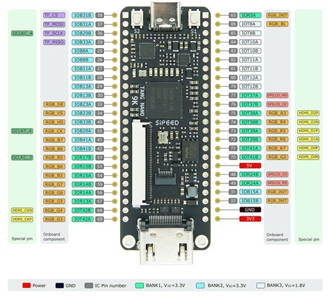
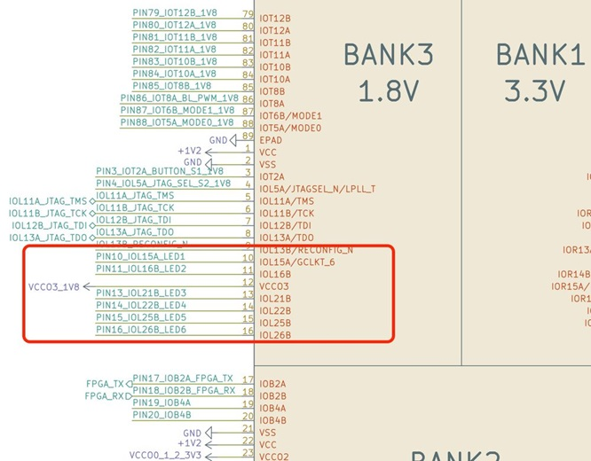

# Tang Nano 9K: Getting Started

 This turorial has two objectives:

 1. Present an overview of FPGAs.
 2. Explain how to use the open source Gowin IDE to develop it.

 We will be using a simple 6-bit counter example to illustrate the discussion. We start with an overview of FPGAs.

## What's an FPGA?

A *Field programmable Gate Array*, or FPGA is an IC that can be "programmed" using hardware logic arrays of gates  unlike the fixed architecture microcontrollers or CPUs which are programmed by software.

A CPU can only understand how to process its own machine codes/assembly language. A set of instructions, written using a programming language, is compiled into these machine codes and the CPU will go through the code to execute those instructions.

The compilation converts an instruction into many assembly instructions, each of which is  serially processed - one at a time and each can take multiple clock cycles. Modern CPUs try to pipeline or parallelize these multiple clock cycles but costing a lot of overhead.

A general purpose CPU is convenient in the sense that one design can be used to perform a lot of different tasks - its general purpose - but the downside is its not very efficient for any specific task.

The internal architecture of an FPGAs is a blank canvas that can be used to custom build  application specific circuits (ASICs). Thus,  applications are programmed in hardware instead of software. There is no central processing unit, each part of the application can be handled in parallel, so we get the effect of having as many parallel cores as needed.

In an FPGA adding new cores / applications has no effect on the existing cores as they are completely separate hardware.

How can an FPGA dynamically reprogram its internal hardware?

At its core an FPGA is made up of lookup tables (LUTs), flip-flops and multiplexers. A lookup table can be thought of as a reconfigurable logic gate, its a prebuilt table, where for each set of inputs there is a predefined output. For example, a lookup table for an AND gate looks like this:

|Input 1 | Input 2 | Output|
|--------|---------|-------|
|    0   |    0    |   0   |
|    1   |    0    |   0   |
|    0   |    1    |   0   |
|    1   |    1    |   1   |

Reprograming this table  as follows:

|Input 1 | Input 2 | Output|
|--------|---------|-------|
|   0    |    0    |   0   |
|   1    |    0    |   1   |
|   0    |    1    |   1   |
|   1    |    1    |   1   |

changes the AND gate into an OR gate. So by just changing the outputs, the internal hardware "changed" from an AND gate to an OR gate.

These reprogrammable gates are combined with flip-flops, which allow for storing data, and multiplexers, which allow for routing connections to realize a method of dynamically "programming" the internal electrical circuit.

In addition to this,  FPGAs usually have built in memory/ram, DSPs or even dedicated math functions but at a high level. LUTs, flip-flops and multiplexers are the core.

## Tang Nano 9K

The Tang Nano 9K FPGA development board  includes an FPGA from Gowin's LittleBee family: the GW1NR-9. This board is cost-effective in terms of the FPGA itself, number of LUTs, Flip-flops, ram and number of IOs. It has on-board LEDs, buttons and a built-in UART debugger and other peripherals. The open-source GWIN IDE supports all the features we will be using.

## The Programming Process

The process of programming an application core onto an FPGA goes through 3 stages:

1. Synthesis
2. Place and Route
3. Bitstream Generation

### Synthesis

The first step is to take a design written in an HDL (Hardware description language) like Verilog and convert it into primitives which make up the FPGA.

In verilog we write our program in terms of modules with registers, connections and logic gates. We also use abstractions like conditional statements or math operations. The job of the synthesis tool is to take all this and convert it to primitives like LUTs and flip-flops.

### Place and Route

The next step - like the name suggests - is to map each of the primitives to their physical counterpart. Like to map each of the generated look up tables to one of  the physical 8640 internal luts.

This step must take into account all the routing requirements when selecting where to place each component, the output of this stage is similar to the output of the synthesis stage, except each of the components are physically mapped.

### Bitstream Generation

The third and final step is generating the bits required so that the FPGA itself understands the layout generated by the place and route stage.

After running these three stages you will have a file which can be programmed onto the FPGA which will reconfigure the internal hardware to match your design.

## GOWIN IDE Tool

Here, we discuss the implimentation of the programming process using GOWIN IDE tool.

### Creating a New Project

Start Gowin IDE, from the Quick Start Menu click `New Project...`


Click `Projects` -> `FPGA Design Project` and  press OK. The next screen lets you give your  project a name. We called our example project "Led_Counter", but you can give it any name you like. Press `Next`.


A new screen opens to let you select the device and package for the project.


To select the Tang Nano board, make sure that the `Filter` section displays (`Series`: `GW1NR`, `Device`: `GW1NR-9`, `Device Version`: `C`). The bottom pane shows all the devices that agree with your filter. In our case only one device is displayed. Click on the device to select it and press `OK`. The next screen displays the new design. It has two panes: the `Design` and a `Design Summary` pane.

The `Design` pane shows a folder with the project name and device and two empty subfolders: `Verilog Files` and `Physical Constraints Files`. The `Verilog Files` subfolder will contain verilog files that describe your circuit in terms of FPGA pins, registers, flow control ...etc.

The `Physical Constraints Files` subfolder will contain a file, known as the phisical constraints file, or CST file, that describes the connections between your circuit and the physical board. These two subfolders consitiute the Synthesis stage of the project.

The `Design Summary pane` displays a summary of your project.


### Creating a Verilog File: An Eaxmple

We illustrate the creation of a verilog file through an example tof a 6-bit binary counter using the on-board LEDs.

The Tang Nano board has 6 built-in leds. If each led represents one bit then we can count up from 0 to 63 (binary 111111). The board has a 27 Mhz clock, each pulse has a period of  Counting every clock pulse means that it takes 63The clock period is $1/(27e6)=0.037 \mu s$. Counting to 63 takes $2.3 \mu s$, which is too fast to observe the counting. A reasonable observing period is, say, half a second, which corresponds to a counter period of $0.5\times 27e6= 13,500,000$ clock cycles.

The verilog module then requires the board clock signal as input will output to be the status of the 6 leds.  

Thus far, the verilog module would look like this.

```verilog
module top
(
    input clk,
    output [5:0] led
);

localparam WAIT_TIME = 13500000;
reg [5:0] ledCounter = 0;

endmodule
```

This code defines a new module called top with an input called clk for the clock signal and 6 outputs called led. These names are arbitratily chosen and will be mapped to actual pins in the .cst file later.

The format for defining an array's size or accessing a group of bits in general is `[MSB:LSB]` which is why 6 bits can be represented as `[5:0]` meaning bit 5 is the most significant bit and bit 0 is the least significant bit, totaling 6 bits.

The next line defines a local constant which will be used at compile time, we have already calculated that we will need 13.5 million clock cycles per counter increment in-order to reach the desired half second delay.

The final line is our actual counter again using the same notation with the `[5:0]` to say it will be a 6 bit wide register.

We will also need a counter for the clock cycles. Looking at the binary representation of 13,500,000 we see it needs 24 bits to contain so we can create a counter with the signature `[23:0]` for 24 bits.

```verilog
reg [23:0] clockCounter = 0;
```

The next thing we need to do is increment our counters on every clock pulse. This can be done with an always block:

```verilog
always @(posedge clk) begin
    clockCounter <= clockCounter + 1;
    if (clockCounter == WAIT_TIME) begin
        clockCounter <= 0;
        ledCounter <= ledCounter + 1;
    end
end
```

The `always` block starts with it's trigger list or sensitivity list. Essentially what needs to happen for the circuit defined inside to occur. In our case we are saying whenever there is a positive edge on the clock pin (a.k.a clock rise) we want the following to happen.

First we will increment the clock counter and then check if we have reached the wait time defined above. If we have reached the wait time then we would like to reset the clock counter to zero and increment the led counter.

We don't need to deal with ever resetting the led counter as it has exactly the number of bits as the desired counter so it will automatically roll over back to 0 once it increments to 63.

It is also worth noting that the `<=` operator is not like a standard assignment operator from most programming languages. This operator sets the value for the input of the flip-flop which will only propagate to the output on the next clock signal. This means that even though we increment it on the first line of the block, the value of `clockCounter` will only equal 1 on the next clock pulse, and for the remainder of the current block the value will still be 0. Same thing when we increment the ledCounter, The change will only be seen on the next clock signal.

There is a way to immediately assign a value using the blocking `=` operator instead, but I like to stick only with the non-blocking assignment operator <= when working with registers, both for simplicity, consistency and I think it is a better practice.

The last and final thing to finish our verilog module is to connect the value of our register to the leds.

```verilog
assign led = ledCounter;
```

Outside the `always` block we use the `assign` and `=` to define the value of wires. Wires (which is the default input/output type) unlike registers don't store values so we need to simply define what they are connected to and they will always equal that value (since they will be physically connected to them).

The full code should look like the following:

```verilog
module top
(
    input clk,
    output [5:0] led
);

localparam WAIT_TIME = 13500000;
reg [5:0] ledCounter = 0;
reg [23:0] clockCounter = 0;

always @(posedge clk) begin
    clockCounter <= clockCounter + 1;
    if (clockCounter == WAIT_TIME) begin
        clockCounter <= 0;
        ledCounter <= ledCounter + 1;
    end
end

assign led = ledCounter;
endmodule
```

### Adding the Verilog file

One way to add a verilog source file to the project is to right-click in the `Design` pane -> `Verilog File` -> `OK` -> give a name to your file -> `OK`. An empty verilog file will be created and you can either type the code above, or copy and paste it. Next you need to synthesise your file. Click on the icon `Run Synthesis` 

### Creating the .cst File

Next, we need to create the .cst file in which we will define the `top` module I/O ports for clk and led. The pinout of the Tang Nano board is shown below.



As can be seen, the 48 board pins are grouped into four banks, BANK1 to BANK3. For example, pin 54 (IOR15A) belongs to BANK1 and so on. GPIO pins of BANK1, BANK2 are 3.3V, but pins of BANK3 (79-86) are 1.8V and should only be used with 1.8v devices or sources.

However, the clk and leds are internally connected to the FPGA pins. To find twhich pins, we need to consult the board manual [schematic](C:/GDOCSII/FPGA/Manuals/Tang_Nano_9K_3672_schematic.pdf) and the schematics therein. The section called "LED x 7"


shows that the onboard leds are connected to PIN10, PIN11, PIN13-PIN16. The schematic



shows that these pins belong to the 1.8V BANK3 as can be expected. Observe also that the LEDs are common anode, all being supplied power directly from the 1.8 voltage source. This means we need to pull our pin down to low (0) in order for the led to light up. This necessitates the following modification of the verilog file.

```verilog
assign led = ~ledCounter;
```

To sum up, the onboard leds are defined as pins 10,11,13,14,15,16.

Similarly, we can find the clock pin in the xtal (crystal oscillator) section.


showing that the clk is pin 52.

We are now ready to create the .cst file where we would define the pins. One way to do this  is as follows.
In the `Design` pane right-click -> `New File` -> `Phisycal Constraints File` -> `OK` ->  give a name to your file -> `OK`. An empty cst file will be created in the subfolder `Physical Constraints File`. To define the IO connections click `Tools` -> `Floor Planner`. In `FloorPlanner` window that appears, acitve the options `I/O Constraints` and `Package View` to see the image below.


You can assign the locations of clk and led by directly typing the pin numbers under `Locations` or dragging and dropping from the cells under `Locations` into the pin numbers of the `Package View Pane`. Click `Save` and close the `FloorPlanner` window. The cst file is created and it looks like this.

```verilog
//Copyright (C)2014-2024 Gowin Semiconductor Corporation.
//All rights reserved. 
//File Title: Physical Constraints file
//Tool Version: V1.9.9.03 Education (64-bit)
//Part Number: GW1N-LV9LQ144C6/I5
//Device: GW1N-9
//Device Version: C
//Created Time: Sun 02 02 08:03:47 2025
IO_LOC "led[5]" 16;
IO_PORT "led[5]" IO_TYPE=LVCMOS18 PULL_MODE=UP DRIVE=8 BANK_VCCIO=1.8;
IO_LOC "led[4]" 15;
IO_PORT "led[4]" IO_TYPE=LVCMOS18 PULL_MODE=UP DRIVE=8 BANK_VCCIO=1.8;
IO_LOC "led[3]" 14;
IO_PORT "led[3]" IO_TYPE=LVCMOS18 PULL_MODE=UP DRIVE=8 BANK_VCCIO=1.8;
IO_LOC "led[2]" 13;
IO_PORT "led[2]" IO_TYPE=LVCMOS18 PULL_MODE=UP DRIVE=8 BANK_VCCIO=1.8;
IO_LOC "led[1]" 11;
IO_PORT "led[1]" IO_TYPE=LVCMOS18 PULL_MODE=UP DRIVE=8 BANK_VCCIO=1.8;
IO_LOC "led[0]" 10;
IO_PORT "led[0]" IO_TYPE=LVCMOS18 PULL_MODE=UP DRIVE=8 BANK_VCCIO=1.8;
IO_LOC "clk" 52;
IO_PORT "clk" IO_TYPE=LVCMOS18 PULL_MODE=UP BANK_VCCIO=1.8;
```

As can be seen, there are two types of constraints for each verilog net variable `IO_LOC` and `IO_PORT`. The first defines the pin number to which it must be connected and the second defines port level constraints such as ull ups/pull downs, logic types drive strength etc.

For more information see [Appendix A](C:/GDOCSII/FPGA/Manuals/SUG935E.pdf)

### Creating the bitstream file

The next step is to create the bitstream file that is understood by the FPGA chip. To create it click the `Place & Route icon` .

### Uploading the code to the FPGA chip

To upload the program to the chip click `Tools` -> `Programmer`. The GOWIN Programmer window appears. Click `Save` in the Cable settings. The programmer window looks like this.


Click the icon `Program/Configure`  in the Programmer window. You should now see the leds on the Tang Nano board counting in birary code.

<video width="600" controls>
<source src="./images/IMG_5501.mp4" type="video/mp4">
Your browser does not support videos.
</video>

## Summary of Gowin IDE project steps

1. New Project(Select Name, Select device).
2. Add verilog file.
3. Run `Synthesis`.
4. Add cst file (Run `Floor Planner`).
5. Create bitstream file (Run `Place & Rout`).
6. Run `Programmer`
7. Run `Program/Configure`
